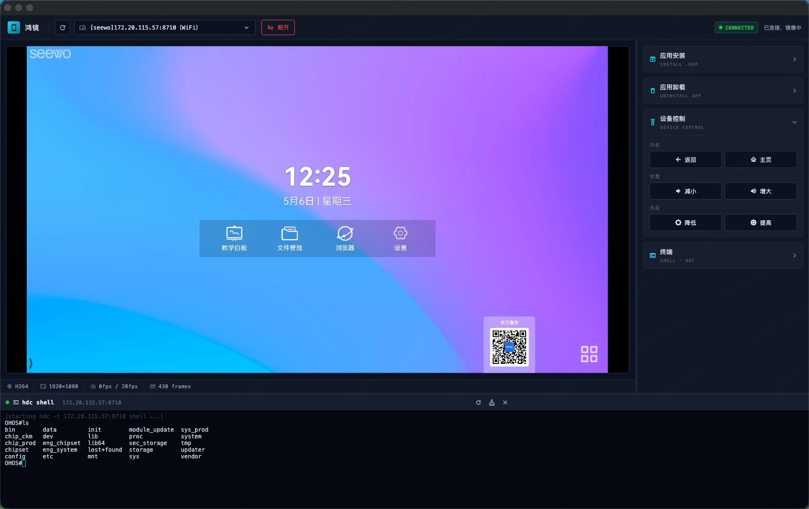

# 鸿镜

鸿镜：OpenHarmony 设备投屏 + HDC 调试工具。



Flutter 桌面客户端通过 `hdc fport` 端口转发与设备上常驻的 OpenHarmony 系统服务通信，实时镜像屏幕并提供触控注入、HAP 安装、HAP卸载、亮度/音量、模拟终端、功能键模拟等控制功能。

## AI Vibe记录
@spec_doc/dev_doc.md 

## AI 技术文档记录
@docs/ 

## 仓库结构

```
ohos-scrcpy-app/
├── scrcpy_server/          # OpenHarmony 系统应用（ServiceExtensionAbility）
│   ├── signature/          # 签名模板（capability.json / permissions.json / scrcpy_server.json）
│   └── entry/src/main/ets/
│       └── scrcpyservice/  # TcpServer、ScreenPipeline、InputInjector、Protocol
├── scrcpy_client_flutter/  # Flutter 桌面客户端（macOS / Windows）
    ├── lib/
    │   ├── hdc/            # hdc CLI 包装（list / fport / install / shell）
    │   ├── net/            # 协议编解码 + TCP 客户端
    │   ├── decoder/        # MethodChannel 'scrcpy/decoder' 抽象
    │   ├── state/          # 中央状态 AppState
    │   └── ui/             # top_bar / mirror_view / sidebar / split_view
    ├── macos/Runner/       # VideoToolbox 硬解插件（Swift）
    ├── windows/runner/     # MediaFoundation 硬解插件（C++）
    └── scripts/            # package_mac.sh（DMG）/ package_win.ps1（Inno Setup）
└── release_packages/       # 预编译包（HAP / DMG / EXE）
```

## 开发环境要求

| 工具 | 版本 |
|------|------|
| Flutter | 3.22.1+ |
| Dart | 3.4+ |
| DevEco Studio | 6.0+ |
| OpenHarmony Full SDK | API 20（compileSdkVersion 20 / compatibleSdkVersion 15+） |
| hdc | 系统 PATH 中 |

## 快速开始

### 1. 编译并安装服务端 HAP

#### 1.1 准备签名证书

服务端以系统应用身份运行，需要使用**自己设备对应的系统签名证书**完成以下配置。

**替换签名配置文件**

将 `scrcpy_server/signature/scrcpy_server.json` 替换为你自己证书签发的版本，参考已有文件结构，确保 `bundle-info.bundle-name` 保持 `com.ohos.scrcpy.server` 不变，`app-privilege-capabilities` 包含：

```
AllowAppUsePrivilegeExtension
KeepAlive
AllowAppDesktopIconHide
```

**向系统写入白名单（需要 root 权限）**

以下两个系统文件需要在设备上提前写入，否则 HAP 安装后无法获得系统级权限与保活能力。参考 `scrcpy_server/signature/` 目录下的模板文件，将 `app_signature` 字段换成你自己证书的指纹。

`/system/etc/app/install_list_capability.json` — 追加能力白名单：

```json
{
  "bundleName": "com.ohos.scrcpy.server",
  "app_signature": ["8E93863FC32EE238060BF69A9B37E2608FFFB21F93C862DD511CBAC9F30024B5"],
  "allowAppUsePrivilegeExtension": true,
  "keepAlive": true,
  "allowAppDesktopIconHide": true
}
```

`/system/etc/app/install_list_permissions.json` — 追加权限白名单：

```json
{
  "bundleName": "com.ohos.scrcpy.server",
  "app_signature": ["8E93863FC32EE238060BF69A9B37E2608FFFB21F93C862DD511CBAC9F30024B5"],
  "permissions": [
    { "name": "ohos.permission.CUSTOM_SCREEN_CAPTURE",        "userCancellable": false },
    { "name": "ohos.permission.START_ABILITIES_FROM_BACKGROUND","userCancellable": false },
    { "name": "ohos.permission.CAPTURE_SCREEN",               "userCancellable": false },
    { "name": "ohos.permission.SYSTEM_FLOAT_WINDOW",          "userCancellable": false },
    { "name": "ohos.permission.EXEMPT_CAPTURE_SCREEN_AUTHORIZE","userCancellable": false },
    { "name": "ohos.permission.GET_INSTALLED_BUNDLE_LIST",    "userCancellable": false }
  ]
}
```

其中ohos.permission.EXEMPT_CAPTURE_SCREEN_AUTHORIZE需要API15

写入后重启设备（或重启 bms 服务）使白名单生效。

#### 1.2 编译 & 安装

```bash
cd scrcpy_server
/Applications/DevEco-Studio.app/Contents/tools/node/bin/node \
  /Applications/DevEco-Studio.app/Contents/tools/hvigor/bin/hvigorw.js \
  clean --mode module -p product=default assembleHap \
  --analyze=normal --parallel --incremental --daemon

hdc install -r entry-default-signed.hap
```

> **提示**：如果不想自行编译，可直接使用 `release_packages/` 目录下预编译的 HAP 包，跳过上方编译步骤。

### 2. 运行 Flutter 客户端

```bash
cd scrcpy_client_flutter
flutter pub get
flutter run -d macos     # macOS
flutter run -d windows   # Windows
```

### 3. 实机联调验证

```bash
# 确认服务端监听
hdc -t <sn> fport tcp:5005 tcp:53535
nc 127.0.0.1 5005        # 能收到字节流即可
```

客户端启动后选择设备 → 点击连接，即可看到实时投屏。

## 通信协议

帧格式：`4B type | 4B length (BE) | payload`

| type | 名称     | 方向 | payload |
|------|----------|------|---------|
| 0x01 | 心跳     | 双向 | 空 / 时间戳 8B |
| 0x02 | 视频配置 | S→C  | width(4) height(4) fps(4) spsLen(2) sps ppsLen(2) pps |
| 0x03 | 视频帧   | S→C  | flags(1, bit0=keyframe) + pts(8) + Annex-B NAL |
| 0x10 | 控制     | C→S  | subType(1) + body |
| 0x20 | 设备状态 | S→C  | subType(1) + body |

`ControlSubType`：触摸 0x01–0x03（x/y/pointerId）、KEY 0x10、VOL_UP/DOWN 0x20/0x21、BR_UP/DOWN 0x22/0x23。

## 关键设计决策

- **HDC**：客户端通过 `Process.run` 调用系统 hdc CLI。
- **视频解码**：macOS 使用 VideoToolbox，Windows 使用 MediaFoundation，通过 MethodChannel + Flutter Texture 上屏。
- **传输通道**：仅 `hdc fport`，USB/网络 hdc 共用同一通道，不做设备 LAN 直连。
- **服务保活**：依赖 `app.json5` 中的 `keepAlive` 配置，不额外注册广播或调用 appManager API。

## 预编译包

`release_packages/` 目录下提供开箱即用的预编译包，无需自行搭建编译环境：

| 文件 | 说明 |
|------|------|
| `*.hap` | 服务端 HAP（需配合上方白名单步骤完成系统签名） |
| `*.dmg` | macOS 客户端安装包 |
| `*.exe` | Windows 客户端安装包 |

## 构建产物

```bash
# macOS DMG
cd scrcpy_client_flutter
flutter build macos --release
bash scripts/package_mac.sh nota # 支持公证

# Windows 安装包（需在 Windows 机器执行）
flutter build windows --release
powershell scripts/package_win.ps1
```

## 许可证

MIT
